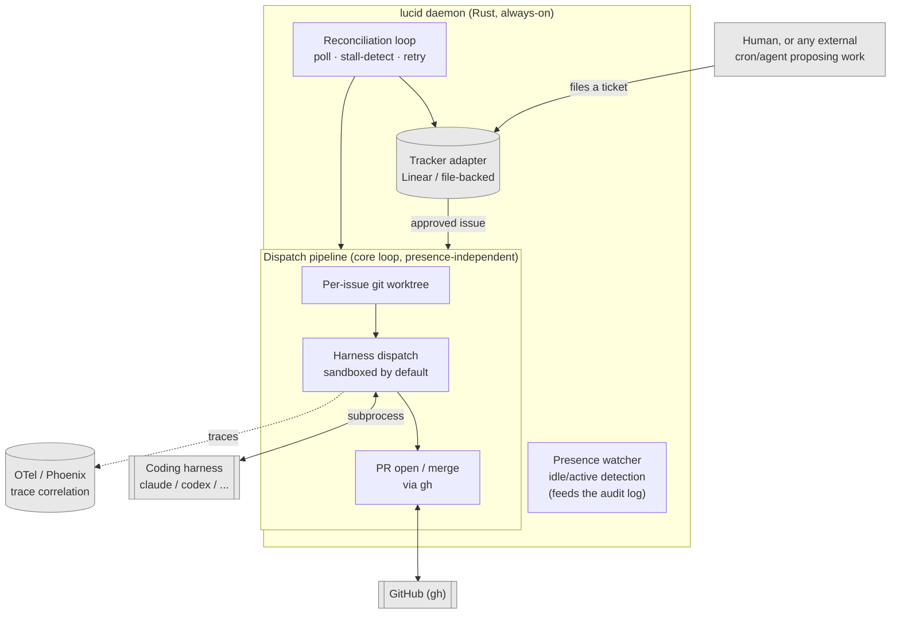

# lucid

Daemon that takes your human-approved tickets and turns them into dispatched, reviewed, merged PRs — continuously, unattended, running alongside whatever you're doing yourself. Named for lucid dreaming: it acts on its own, but stays directed within bounds you set, never fully unsupervised.

## Which layer this is

Coding-agent systems stack into layers, and each one swaps independently of the ones around it. lucid owns exactly one: turning a queue of approved tickets into an ongoing stream of dispatched, reconciled PRs. Nothing above that (deciding what's worth building) and nothing below it (how any single task actually gets solved).

| Layer | What it is | lucid's relationship |
|---|---|---|
| Task origination | Deciding a ticket should exist | Out of scope — a human or an external cron/agent files it through the tracker; lucid can't tell them apart |
| **Inter-task orchestration** | **Sequencing one-shot tasks into an ongoing project** | **Lives here** — queue → worktree → sandboxed dispatch → PR |
| Intra-task composition | How one task gets solved inside a harness — one model, or a harness spawning its own sub-agents | Invisible — one dispatch, one process, one diff back |
| Agent harness | A bounded process: starts, does a task, exits (`claude`, `codex`, `hermes`, pi, ...) | Spawned via `HarnessProfile.cmd`/`args`, sandboxed around, never reached into |
| LLM API | The model | Never called directly — whatever the harness picked |

More on why this boundary is where it is: [`docs/wiki/architecture/overview.md`](docs/wiki/architecture/overview.md).

## Quickstart

Requires `git` and an authenticated [`gh`](https://cli.github.com/) on `PATH` — every dispatch pushes a branch and opens/merges its PR through `gh`.

```bash
cargo build --release
export PATH="$PWD/target/release:$PATH"
```

Write a `lucid.toml` (file-backed tracker, no credentials needed to try it out):

```toml
[[harness_profiles]]
name = "claude-subscription"
kind = "ClaudeCode"
cmd = "claude"
args = ["-p"]
auth_mode = "Subscription"
priority = 1

[tracker]
backend = "file"
file_path = "state/tracker.json"

[presence]
idle_threshold_minutes = 20
```

Then:

```bash
lucid config validate
lucid start --foreground
```

Every field, every default: [`docs/CONFIGURATION.md`](docs/CONFIGURATION.md). Every command: [`docs/CLI.md`](docs/CLI.md).

## How it fits together



Every backend above — tracker, presence source, harness execution, notifications — is a trait with a config-selected implementation, and any of them can be a plain script instead of compiled Rust: drop an executable in `.lucid/notify/on_needs_review` and that's a complete Discord/Slack/anything integration, no change to lucid itself. Ready-to-copy examples: [`docs/notify-scripts/`](docs/notify-scripts/). Design: [`docs/wiki/architecture/extensibility-primitives.md`](docs/wiki/architecture/extensibility-primitives.md).

## Docs

- [`docs/CLI.md`](docs/CLI.md) — every command
- [`docs/CONFIGURATION.md`](docs/CONFIGURATION.md) — every `lucid.toml` field and default
- [`docs/FEATURES.md`](docs/FEATURES.md) — what's built vs. still open
- [`docs/wiki/index.md`](docs/wiki/index.md) — architecture decisions and the reasoning behind them, not required reading to use lucid
