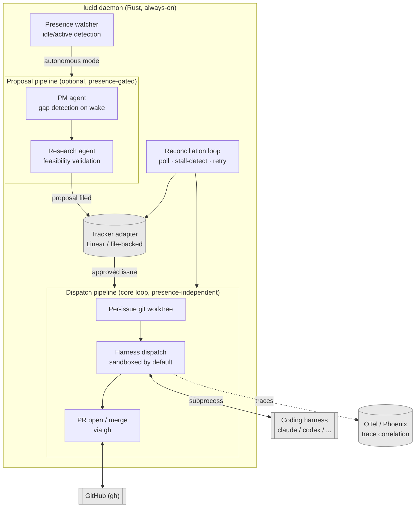

# lucid

Daemon that dispatches your approved tickets to a coding harness in the background, in parallel with whatever you're working on yourself.

Named for lucid dreaming: it acts on its own, but stays directed within bounds you set — never fully unsupervised.

- **Dispatches** approved tickets to a coding harness (`claude -p`, `codex exec`, ...) in an isolated git worktree, sandboxed by default — runs continuously, whether you're at the keyboard or not, since each ticket was already human-approved.
- **Reconciles**: retries stalled runs, opens/merges PRs via `gh`, reports back.
- **Optionally investigates** the repo against a stated goal and flags gaps as new proposals for you to approve — this proactive gap-finding is presence-gated, only running once you've gone idle, unlike ticket dispatch itself.
- Tracker-agnostic, harness-agnostic, model-agnostic by design.

See [`docs/wiki/index.md`](docs/wiki/index.md) for full architecture and resolved decisions, and [`docs/FEATURES.md`](docs/FEATURES.md) for what's built vs. still open.

## How it fits together



One small standalone process, no framework. Two other things worth knowing at a glance:

**Every backend is swappable** — same shape everywhere, a trait with a config-selected implementation:

| Backend | Built-in options |
|---|---|
| Tracker | Linear, local file |
| Presence source | logind (dead on WSL2), manual override |
| Harness execution | Sandboxed (Docker), Local |
| Notifications | none (default), script |

**Any of those can be a plain script instead of Rust**, not just a compiled-in option — drop an executable in `.lucid/notify/on_needs_review` and it's a complete Discord/Slack/anything integration, no code change to lucid itself. Ready-to-copy examples: [`docs/notify-scripts/`](docs/notify-scripts/). Design details: [extensibility primitives](docs/wiki/architecture/extensibility-primitives.md).

Full breakdown: [`docs/wiki/architecture/overview.md`](docs/wiki/architecture/overview.md) for the component categories, [`docs/FEATURES.md`](docs/FEATURES.md) for built-vs-open.

## Quickstart

Requires `git` and an authenticated [`gh`](https://cli.github.com/) on `PATH` — every dispatch pushes a branch and opens/merges its PR through `gh`.

```bash
cargo build --release
export PATH="$PWD/target/release:$PATH"

# write lucid.toml — see Configuration below for what goes in it
docker compose up -d          # optional: Arize Phoenix, for trace correlation
lucid config validate
lucid presence override autonomous   # logind auto-detection isn't wired up yet
lucid start --foreground
```

Full command reference: [`docs/CLI.md`](docs/CLI.md).

## Configuration

`lucid` reads a single TOML file (`./lucid.toml` by default). Minimal working example, file-backed tracker, no credentials needed:

```toml
[[harness_profiles]]
name = "claude-subscription"
kind = "ClaudeCode"
cmd = "claude"
args = ["-p"]
auth_mode = "Subscription"
priority = 1

[tracker]
backend = "file"
file_path = "state/tracker.json"

[presence]
idle_threshold_minutes = 20
proposal_cap_per_wake = 3

[observability]
otlp_endpoint = "http://localhost:4317"
trace_ui_base_url = "http://localhost:6006"
```

Full field reference (every section, every default): [`docs/CONFIGURATION.md`](docs/CONFIGURATION.md).
