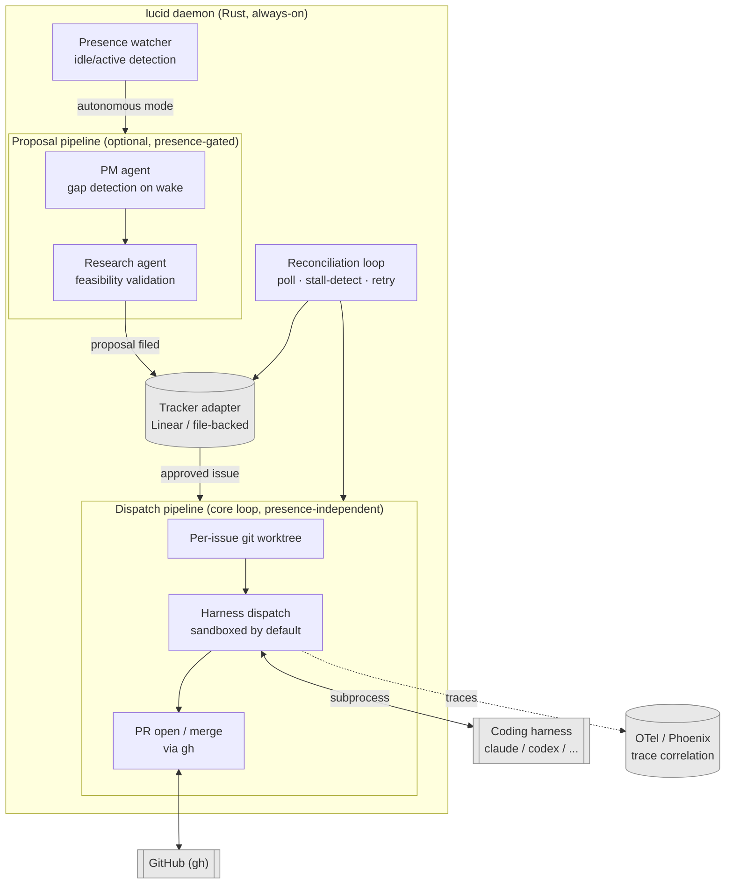

# lucid

Daemon that dispatches your approved tickets to a coding harness in the background, in parallel with whatever you're working on yourself.

Named for lucid dreaming: it acts on its own, but stays directed within bounds you set — never fully unsupervised.

- **Dispatches** approved tickets to a coding harness (`claude -p`, `codex exec`, ...) in an isolated git worktree, sandboxed by default — runs continuously, whether you're at the keyboard or not, since each ticket was already human-approved.
- **Reconciles**: retries stalled runs, opens/merges PRs via `gh`, reports back.
- **Optionally investigates** the repo against a stated goal and flags gaps as new proposals for you to approve — this proactive gap-finding is presence-gated, only running once you've gone idle, unlike ticket dispatch itself.
- Tracker-agnostic, harness-agnostic, model-agnostic by design.

See [`docs/wiki/index.md`](docs/wiki/index.md) for full architecture and resolved decisions, and [`docs/FEATURES.md`](docs/FEATURES.md) for what's built vs. still open.

## How it fits together



Everything inside the daemon is one small standalone process — no framework, no embedded agent host. Each labeled piece has its own wiki page: [presence](docs/wiki/architecture/presence-detection.md), [PM scope](docs/wiki/architecture/pm-scope.md), [research agent](docs/wiki/architecture/research-agent.md), [tracker adapter](docs/wiki/architecture/tracker-adapter.md), [harness dispatch](docs/wiki/architecture/harness-dispatch.md), [sandboxed execution](docs/wiki/architecture/sandboxed-execution.md), [worker completion](docs/wiki/architecture/worker-completion.md), [reconciliation](docs/wiki/architecture/symphony-patterns.md).

See [`docs/FEATURES.md`](docs/FEATURES.md) for the itemized built-vs-open breakdown.

## Quickstart

Requires `git` and an authenticated [`gh`](https://cli.github.com/) on `PATH` — every dispatch pushes a branch and opens/merges its PR through `gh`.

```bash
cargo build --release
export PATH="$PWD/target/release:$PATH"

# write lucid.toml — see Configuration below for what goes in it
docker compose up -d          # optional: Arize Phoenix, for trace correlation
lucid config validate
lucid presence override autonomous   # logind auto-detection isn't wired up yet
lucid start --foreground
```

Full command reference: [`docs/CLI.md`](docs/CLI.md).

## Configuration

`lucid` reads a single TOML file, resolved in this order: `--config <path>`, then `./lucid.toml`, then `$XDG_CONFIG_HOME/lucid/config.toml`. Validate it with `lucid config validate` before starting the daemon.

Minimal working example (file-backed tracker, no Linear credentials needed):

```toml
[[harness_profiles]]
name = "claude-subscription"
kind = "ClaudeCode"
cmd = "claude"
args = ["-p"]
auth_mode = "Subscription"
priority = 1

[tracker]
backend = "file"
file_path = "state/tracker.json"

[presence]
idle_threshold_minutes = 20
proposal_cap_per_wake = 3

[observability]
otlp_endpoint = "http://localhost:4317"
trace_ui_base_url = "http://localhost:6006"
```

### `[[harness_profiles]]`

One entry per dispatch target; multiple profiles for the same harness (e.g. a subscription profile plus an API-key fallback) run in `priority` order.

| Field | Type | Notes |
|---|---|---|
| `name` | string | Free-form label, shown in dispatch logs/status. |
| `kind` | `"ClaudeCode"` \| `"Codex"` | Which harness binary this profile drives. |
| `cmd` | string | The binary to invoke (e.g. `claude`, `codex`). |
| `args` | string[] | Static args; the task prompt is appended at dispatch time. |
| `auth_mode` | `"Subscription"` \| `"ApiKey"` | `Subscription` reads the harness's existing login; `ApiKey` forces metered billing (e.g. `ANTHROPIC_API_KEY`/`OPENAI_API_KEY`). |
| `priority` | integer | Lower runs first. |

### `[tracker]`

| Field | Type | Notes |
|---|---|---|
| `backend` | `"file"` \| `"linear"` | `file` needs no credentials; `linear` talks to Linear's real GraphQL API. |
| `file_path` | string | Required for `backend = "file"`. Where the JSON store lives. |
| `api_key_env` | string | Required for `backend = "linear"`. Env var holding the API key (e.g. `LINEAR_API_KEY`). |
| `team_key` | string | Required for `backend = "linear"`. Linear's short team key (e.g. `ENG`), not its UUID. |
| `project_key` | string | Optional, `linear` only. Scopes lucid to one Linear project within `team_key` — Linear issues don't require a project, so omitting this operates team-wide. |
| `managed_label` | string | Optional, `linear` only. Scopes every lucid query further to issues carrying this label, and `create_proposal` attaches it automatically. Prevents a human moving an unrelated issue into the same workflow state from being swept into lucid's dispatch loop. Omitting this preserves today's team/project-only scoping. |

### `[presence]`

| Field | Type | Notes |
|---|---|---|
| `idle_threshold_minutes` | integer | Minutes of sustained idle before flipping to autonomous mode. |
| `proposal_cap_per_wake` | integer | Max proposals a single PM wake cycle may file. |
| `override_path` | string | Optional. Defaults to `$XDG_STATE_HOME/lucid/presence-override` (or `~/.local/state/...`). |

### `[observability]`

| Field | Type | Notes |
|---|---|---|
| `otlp_endpoint` | string | Where dispatched harnesses send OTel traces/logs (e.g. Phoenix's `http://localhost:4317`). |
| `trace_ui_base_url` | string | Base URL of the trace UI, used to build the trace link posted back to the tracker item. |
| `trace_ui_project_id` | string | Optional. Falls back to `"default"` (Phoenix's default project). |
| `log_prompts` | bool | Optional, defaults to `false`. Opt-in prompt/tool-content capture — this is the point where the trace store starts holding sensitive content. |

### `[daemon]` (optional — every field has a default)

| Field | Type | Default | Notes |
|---|---|---|---|
| `tick_interval_secs` | integer | `30` | How often the reconciliation loop checks presence and dispatches approved issues. |
| `stall_timeout_secs` | integer | `600` | Hard wall-clock limit before a harness process is killed and marked `TimedOut`. |
| `pm_wake_interval_mins` | integer | `60` | Minimum time between PM gap-detection wake cycles while autonomous. |
| `workdir` | string | `"."` | The main repo checkout. Every dispatch's worktree branches off `base_branch`'s tip here, and this is where `gh pr create`/`gh pr merge` run from. |
| `base_branch` | string | `"main"` | Branch each dispatch's worktree is created from, and PRs target. |
| `worktree_root` | string | system temp dir | Where per-issue worktrees are created — kept outside `workdir` so they never show up in the main repo's own `git status`. |
| `verify_cmd` | string | unset | Repo-wide default command for `ReviewMode::Agent`'s verify step (e.g. `cargo test`); a per-task `verify_cmd` overrides it. |

### `[[projects]]` (optional — not yet consumed by the daemon loop)

Pointers to other repos this daemon instance watches, not full config blocks:

```toml
[[projects]]
path = "/home/drk/github/some-other-repo"
```

Each pointed-to repo is expected to carry its own checked-in `lucid.project.toml` at that path, declaring the repo-owned settings — same `WORKFLOW.md`-style split as Symphony (see [`docs/wiki/architecture/multi-project.md`](docs/wiki/architecture/multi-project.md)):

```toml
project_key = "ENG-123"     # optional — tracker project to scope issues to
verify_cmd = "cargo test"   # optional — this project's verify step
base_branch = "main"        # optional, defaults to "main"
```

`lucid config validate` resolves and validates every configured project's `lucid.project.toml`, failing with a per-project error if one is missing or malformed. Wiring `[[projects]]` into the actual dispatch loop (today's daemon still only drives `[daemon].workdir`) is tracked separately.
