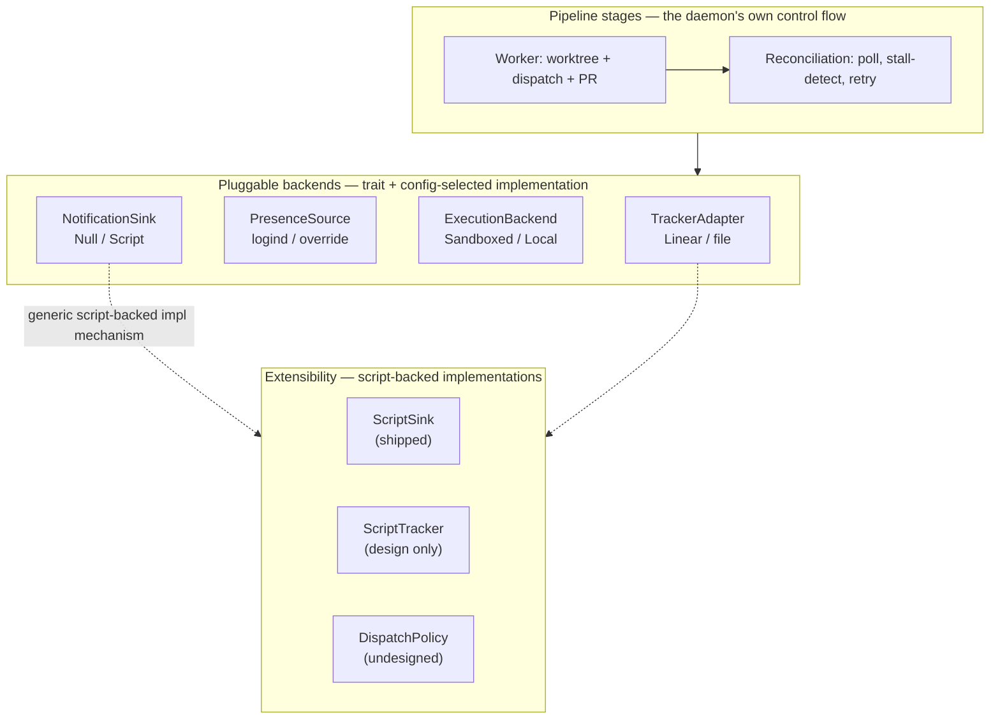

# System Overview

lucid is the layer above a coding harness: it dispatches already-approved tickets to a sandboxed coding harness, reconciles the result (retries, PR open/merge, tracker state), and stops there. It does not decide what work should exist — that's out of scope by design, not a missing feature. It's composed of open-source building blocks — agnostic to tracker, coding harness, and model.

## Core roles

1. **Worker** — monitors the tracker for approved tasks, executes via a coding harness, opens PRs. Runs continuously, **presence-independent**: a human already approved that specific ticket, so dispatching it isn't unsupervised action. This half exists in many forms already (see [prior-art landscape](../research/prior-art-landscape.md)) — lucid's job is doing it well (sandboxed by default, tracker-agnostic, harness-agnostic, script-extensible), not inventing a new category.
2. **Human** — files or approves tickets, reviews PRs. The only origin point for new work lucid ever acts on: `lucid task create`, direct tracker approval, or any external tool that files a ticket through the same `TrackerAdapter` — lucid treats all three identically. See [tracker adapter](tracker-adapter.md).

Proactive gap-detection ("what should get built next," investigating a repo unprompted and proposing new work) is a real, useful capability — see [prior-art landscape](../research/prior-art-landscape.md) and [pm-layer-novelty](../research/pm-layer-novelty.md) for why nothing else in the ecosystem does it well either. lucid deliberately does not build it: anything that wants to propose work files a ticket through the tracker like a human would, using the same `review:`/`verify_cmd` frontmatter contract (see [agent handoff](agent-handoff.md)) — external cron jobs and agents are a first-class way to drive lucid, not a workaround. This keeps lucid's own control surface to one deterministic loop (poll, dispatch, retry, reconcile) instead of an LLM-reasoning "should this exist" judgment call, and keeps the [matplotlib incident](../research/matplotlib-incident.md) failure mode (an agent with a stake in defending its own idea) entirely outside lucid's process boundary.

## Key constraints

- **Tracker-agnostic** — not locked to Linear. See [tracker adapter](tracker-adapter.md).
- **Harness-agnostic** — not locked to any one coding CLI. See [harness dispatch](harness-dispatch.md).
- **Model-agnostic** — nothing in lucid itself calls an LLM; only the dispatched harness does.
- **Sandboxed by default** — dispatch runs in an isolated container unless explicitly opted out. See [sandboxed execution](sandboxed-execution.md).
- **Extensible without forking** — every pluggable primitive below can optionally be implemented as a script instead of embedded Rust. See [extensibility primitives](extensibility-primitives.md).

## Architectural correction: standalone, not embedded in Hermes

An early draft of this design made Hermes (the user's existing always-on agent) the host process — a "PM bot profile" living inside Hermes, dispatching `claude -p` from there. That was reconsidered: the orchestration core (poll, dispatch, track state, retry, reconcile) is a **deterministic control loop** — a systems-engineering problem, not an LLM-reasoning one — and doesn't need or benefit from running inside an agent framework.

The corrected shape: lucid is its own small standalone process. Hermes becomes one interchangeable *harness backend* (`hermes -p "task"`), on equal footing with `claude -p` / `codex exec`, not the foundation everything else sits on. This is what "harness-agnostic" already implied — embedding in Hermes would have quietly violated that constraint by making Hermes load-bearing instead of swappable. See [tech stack](tech-stack.md) for the resulting implementation choice (Rust, not Python/Hermes-hosted).

## Components, by category

Everything in the daemon falls into one of three kinds of primitive. Confusing them is the most common way to misread this wiki: a **pipeline stage** is control flow specific to lucid's own loop (not swappable, not pluggable — the daemon's actual shape); a **pluggable backend** is a trait with a config-selected implementation, answering "what external system does this talk to"; **extensibility** is a mechanism layered on top of the pluggable backends, answering "can a script implement this instead of Rust" — see [extensibility primitives](extensibility-primitives.md) for why that's one mechanism reused everywhere rather than a separate hooks system.

Concretely:

- **Pipeline stages** (not swappable, this *is* lucid's shape): Worker executor (per-issue worktree isolation, harness dispatch, PR open/merge — see [harness dispatch](harness-dispatch.md), [worker completion](worker-completion.md)), Reconciliation loop (presence-independent poll tick — see [symphony patterns](symphony-patterns.md)).
- **Pluggable backends** (trait + `build()`-style config dispatcher, same shape reused four times): `TrackerAdapter` (Linear/file — [tracker adapter](tracker-adapter.md)), `PresenceSource` (logind/override — [presence detection](presence-detection.md)), `HarnessProfile`/`ExecutionBackend` (Sandboxed/Local, any harness binary — [harness dispatch](harness-dispatch.md), [sandboxed execution](sandboxed-execution.md)), `NotificationSink` (Null/Script — [human-in-the-loop](human-in-the-loop.md)).
- **Extensibility mechanism** (layered on the pluggable-backend pattern, not a separate system — [extensibility primitives](extensibility-primitives.md)): `ScriptSink` is shipped; script-backed `TrackerAdapter`/`PresenceSource` and a `DispatchPolicy` pre-dispatch gate are designed but not built.
- **Cross-cutting, not in any one category**: multi-project support ([multi-project](multi-project.md) — one daemon, many `ProjectRuntime`s), persistence ([persistence](persistence.md) — flat files over a database), observability ([observability](observability.md), [trace-correlation](trace-correlation.md)).

Almost everything here is net-new code, deliberately — each piece is small and well-scoped (a poll loop, a D-Bus watcher, a handful-of-methods tracker adapter, git-worktree management, subprocess dispatch), not a framework. Symphony proves this shape works as a lean standalone daemon.

## Related pages

- [Tech stack](tech-stack.md) — why Rust
- [Presence detection](presence-detection.md)
- [Tracker adapter](tracker-adapter.md)
- [Harness dispatch](harness-dispatch.md)
- [Sandboxed execution](sandboxed-execution.md)
- [Extensibility primitives](extensibility-primitives.md) — the script-backed-implementation mechanism, and which pieces have it today
- [Multi-project](multi-project.md)
- [Symphony patterns](symphony-patterns.md) — what was borrowed directly from prior art
- [Prior-art landscape](../research/prior-art-landscape.md) — the systems survey, and why a proactive-PM layer specifically stays out of lucid's own scope
- [PM-layer novelty](../research/pm-layer-novelty.md) — why nothing in the ecosystem covers proactive gap-detection well, and why that's still not a reason for lucid to build it
