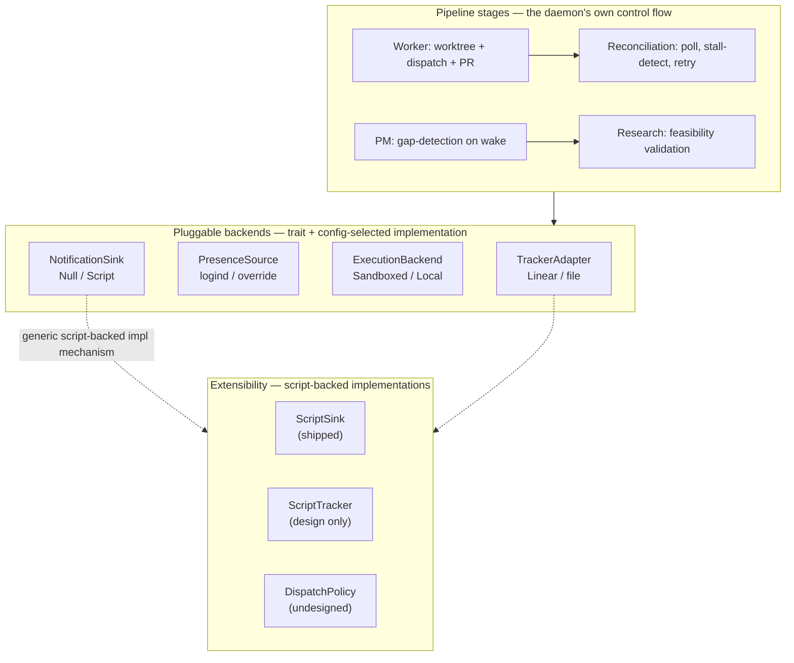

# System Overview

lucid is a multi-agent orchestration system whose agents don't just execute tasks but **proactively investigate**, **propose work**, and **continue development** while the user is away. It's composed of open-source building blocks — agnostic to tracker, coding harness, and model.

## Core roles

1. **Worker Agent** — monitors the tracker for approved tasks, executes via a coding harness, opens PRs. Runs continuously, **presence-independent**: a human already approved that specific ticket, so dispatching it isn't unsupervised action the same way proactive investigation is. This half exists in many forms already (see [prior-art landscape](../research/prior-art-landscape.md)); the novelty here is the layer above it, not the Worker itself.
2. **PM Agent** — investigates the repo, identifies gaps against a stated goal, proposes tasks. Hands off to the Research agent for validation. Files proposals as tracker issues. Optional, **presence-gated**: only runs once the operator has gone idle. This is the differentiated piece — see [PM scope](pm-scope.md) and [prior-art landscape](../research/prior-art-landscape.md) for why nothing existing covers it.
3. **Research Agent** — validates a proposed task (feasibility, prior art, dependency compatibility) before the PM files it. See [research agent](research-agent.md).
4. **Human** — reviews proposals as binary decisions, reviews PRs. The system respects presence for the *proactive* layer (role 2): when the user is at the keyboard, the PM doesn't go looking for new work; when idle, it does. Presence does not gate role 1 — see [presence detection](presence-detection.md).

## Key constraints

- **Tracker-agnostic** — not locked to Linear. See [tracker adapter](tracker-adapter.md).
- **Harness-agnostic** — not locked to any one coding CLI. See [harness dispatch](harness-dispatch.md).
- **Model-agnostic** — each role can use a different model.
- **Presence-aware trigger** — not a naive cron, and not blanket either: gates proactive investigation, not approved-work dispatch. See [presence detection](presence-detection.md).
- **Sandboxed by default** — dispatch runs in an isolated container unless explicitly opted out. See [sandboxed execution](sandboxed-execution.md).
- **Extensible without forking** — every pluggable primitive below can optionally be implemented as a script instead of embedded Rust. See [extensibility primitives](extensibility-primitives.md).

## Architectural correction: standalone, not embedded in Hermes

An early draft of this design made Hermes (the user's existing always-on agent) the host process — a "PM bot profile" living inside Hermes, dispatching `claude -p` from there. That was reconsidered: the orchestration core (poll, dispatch, track state, retry, reconcile) is a **deterministic control loop** — a systems-engineering problem, not an LLM-reasoning one — and doesn't need or benefit from running inside an agent framework.

The corrected shape: lucid is its own small standalone process. Hermes becomes one interchangeable *harness backend* (`hermes -p "task"`), on equal footing with `claude -p` / `codex exec`, not the foundation everything else sits on. This is what "harness-agnostic" already implied — embedding in Hermes would have quietly violated that constraint by making Hermes load-bearing instead of swappable. See [tech stack](tech-stack.md) for the resulting implementation choice (Rust, not Python/Hermes-hosted).

## Components, by category

Everything in the daemon falls into one of three kinds of primitive. Confusing them is the most common way to misread this wiki: a **pipeline stage** is control flow specific to lucid's own loop (not swappable, not pluggable — the daemon's actual shape); a **pluggable backend** is a trait with a config-selected implementation, answering "what external system does this talk to"; **extensibility** is a mechanism layered on top of the pluggable backends, answering "can a script implement this instead of Rust" — see [extensibility primitives](extensibility-primitives.md) for why that's one mechanism reused everywhere rather than a separate hooks system.

Concretely:

- **Pipeline stages** (not swappable, this *is* lucid's shape): Worker executor (per-issue worktree isolation, harness dispatch, PR open/merge — see [harness dispatch](harness-dispatch.md), [worker completion](worker-completion.md)), Reconciliation loop (presence-independent poll tick — see [symphony patterns](symphony-patterns.md)), PM gap-detection job (presence-gated — see [pm scope](pm-scope.md)), Research agent (validates before filing — see [research agent](research-agent.md)).
- **Pluggable backends** (trait + `build()`-style config dispatcher, same shape reused four times): `TrackerAdapter` (Linear/file — [tracker adapter](tracker-adapter.md)), `PresenceSource` (logind/override — [presence detection](presence-detection.md)), `HarnessProfile`/`ExecutionBackend` (Sandboxed/Local, any harness binary — [harness dispatch](harness-dispatch.md), [sandboxed execution](sandboxed-execution.md)), `NotificationSink` (Null/Script — [human-in-the-loop](human-in-the-loop.md)).
- **Extensibility mechanism** (layered on the pluggable-backend pattern, not a separate system — [extensibility primitives](extensibility-primitives.md)): `ScriptSink` is shipped; script-backed `TrackerAdapter`/`PresenceSource` and a `DispatchPolicy` pre-dispatch gate are designed but not built.
- **Cross-cutting, not in any one category**: multi-project support ([multi-project](multi-project.md) — one daemon, many `ProjectRuntime`s), persistence ([persistence](persistence.md) — flat files over a database), observability ([observability](observability.md), [trace-correlation](trace-correlation.md)).

Almost everything here is net-new code, deliberately — each piece is small and well-scoped (a poll loop, a D-Bus watcher, a handful-of-methods tracker adapter, git-worktree management, subprocess dispatch), not a framework. Symphony proves this shape works as a lean standalone daemon.

## Related pages

- [Tech stack](tech-stack.md) — why Rust
- [Presence detection](presence-detection.md)
- [Tracker adapter](tracker-adapter.md)
- [Harness dispatch](harness-dispatch.md)
- [Sandboxed execution](sandboxed-execution.md)
- [PM scope](pm-scope.md)
- [Extensibility primitives](extensibility-primitives.md) — the script-backed-implementation mechanism, and which pieces have it today
- [Multi-project](multi-project.md)
- [Symphony patterns](symphony-patterns.md) — what was borrowed directly from prior art
- [Prior-art landscape](../research/prior-art-landscape.md) — why the PM layer specifically is the novel piece
